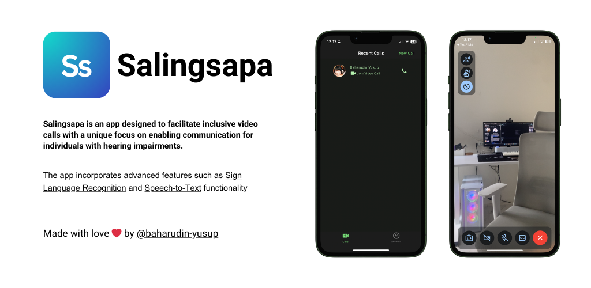

<a href='https://apps.apple.com/app/salingsapa/id6447261524'></a>
<a href='https://play.google.com/store/apps/details?id=dev.baharudin.salingsapa&pcampaignid=pcampaignidMKT-Other-global-all-co-prtnr-py-PartBadge-Mar2515-1'></a>

# Salingsapa

[](https://codemagic.io/apps/642645586c092f62d7cd27b1/642c4ec2aac5ee7954a0bf2e/latest_build)

Salingsapa is a [Flutter](https://flutter.dev) application designed to facilitate inclusive video
calls with a unique focus
on enabling communication for individuals with hearing impairments. The app incorporates advanced
features such
as [Sign Language Recognition](https://en.wikipedia.org/wiki/Sign_language_recognition)
and [Speech-to-Text](https://aws.amazon.com/what-is/speech-to-text/) functionality. It follows the
principles
of [Clean Architecture](https://blog.cleancoder.com/uncle-bob/2012/08/13/the-clean-architecture.html)
and utilizes [BLoC state management](https://bloclibrary.dev/).

## 🚀 Features

### Inclusive Video Calls

- Conduct video calls with a unique emphasis on inclusivity.
- [Sign Language Recognition](https://en.wikipedia.org/wiki/Sign_language_recognition)
  and [Speech-to-Text](https://aws.amazon.com/what-is/speech-to-text/) features for enhanced
  communication.

### WebRTC with Agora Integration

- Seamless video calls powered by WebRTC with [Agora](https://www.agora.io/en/) for high-quality and
  efficient communication.

### Firebase Backend

- Robust backend infrastructure provided by [Firebase](https://firebase.google.com/).
- Features include authentication, messaging, and remote configuration.

### Speech-to-Text Conversion

- Utilizes native Android and iOS APIs for
  real-time [Speech-to-Text](https://aws.amazon.com/what-is/speech-to-text/) conversion.

### Sign Language Recognition

- Employs [TensorFlowLite](https://www.tensorflow.org/lite) to recognize and interpret Sign Language
  gestures.

### Clean Architecture and BLoC State Management

- Ensures maintainability and scalability
  through [Clean Architecture](https://blog.cleancoder.com/uncle-bob/2012/08/13/the-clean-architecture.html).
- [BLoC state management](https://bloclibrary.dev/) for efficient handling of application state.

## ▶️ How to Run the App

### Prerequisites

Before you begin, make sure you have:

- Flutter installed on your machine.
- An emulator or a physical device connected for testing.

### Steps

1. **Clone the Repository**
   ```shell
   git clone https://github.com/baharudin-yusup/salingsapa.git
   cd salingsapa
   ```

2. **Install Dependencies**
   ```shell
   flutter pub get
   ```

3. **Generate Firebase Configuration**
    - Development:
      ```shell
      flutterfire config \
      --project=salingsapa-project \
      --out=lib/firebase_options_dev.dart \
      --ios-bundle-id=dev.baharudin.salingsapa-dev \
      --android-app-id=dev.baharudin.salingsapa.dev
      ```
    - Production:
      ```shell
      flutterfire config \
      --project=salingsapa-project \
      --out=lib/firebase_options_prod.dart \
      --ios-bundle-id=dev.baharudin.salingsapa \
      --android-package-name=dev.baharudin.salingsapa
      ```

4. **Run the App**
    - Development
      ```shell
      flutter run --flavor dev --target=lib/main_dev.dart
      ```
    - Production
      ```shell
      flutter run --flavor prod --target=lib/main_prod.dart
      ```

## 🛠️ Technical Specifications

### Dependencies

Salingsapa utilizes a variety of Flutter packages and external libraries to deliver its
functionalities. Here are some key dependencies:

- **Firebase**
    - Provides a robust backend infrastructure, including authentication, messaging, and remote
      configuration.
    -
  Package: `firebase_core`, `firebase_analytics`, `firebase_auth`, `firebase_messaging`, `firebase_remote_config`, `cloud_firestore`, `firebase_app_check`, `firebase_storage`

- **State Management**
    - Ensures efficient handling of application state.
    - Package: `bloc`, `flutter_bloc`, `freezed`, `equatable`

- **UI/UX**
    - Enhances user interface and experience.
    - Package: `dynamic_color`, `flutter_localizations`, `intl`, `flutter_markdown`

- **WebRTC**
    - Enables seamless video calls.
    - Package: `agora_rtc_engine`

- **TensorFlowLite**
    - Powers Sign Language Recognition.
    - Package: `tflite`

- **HTTP Requests**
    - Manages HTTP requests for data communication.
    - Package: `dio`

- **Contacts Service**
    - Facilitates access to device contacts.
    - Package: `flutter_contacts`

### Continuous Integration and Deployment

Automated CI/CD through [Codemagic](https://codemagic.io/) for
streamlined development.

### Dataset

The Sign Language Recognition model is trained on
the [ASL Alphabet dataset by Akash](https://www.kaggle.com/datasets/grassknoted/asl-alphabet/data)